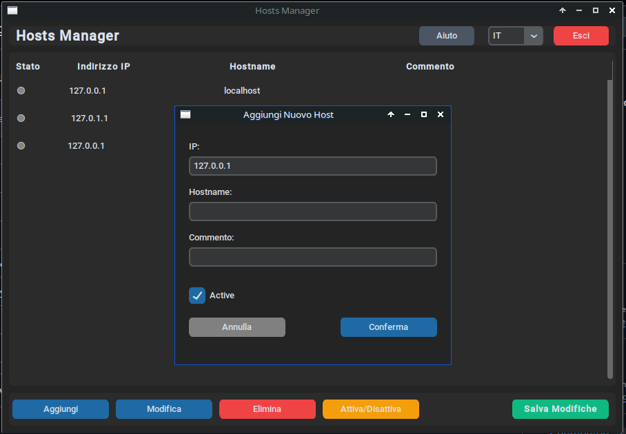

# Hosts Manager

<p align="center">
  <br>
  
</p>

Un potente strumento grafico (GUI) per gestire facilmente il file `/etc/hosts` in ambiente di sviluppo (Linux, e compatibile Windows/macOS). Supporta aggiunte, modifiche e disattivazioni rapide di directive, senza la necessità di eseguire l'intera interfaccia come utente root.

## Funzionalità

- **Visualizzazione Chiara**: Tabella pulita che elenca indirizzi IP, Hostname e Commenti associati.
- **Gestione Veloce**: Aggiungi, Modifica, Elimina e "Toggle" rapido (per commentare o decommentare le righe al volo durante lo sviluppo o una migrazione).
- **Edit Intuitivo**: Fai doppio click su una riga per aprire istantaneamente la finestra di modifica.
- **Sicurezza in Salvataggio**: Apre un popup per chiedere i privilegi di amministratore (tramite `sudo`) *esclusivamente* nel momento del salvataggio. Non si esegue in modalità "pericolosa" tutto il tempo.
- **Backup Automatico**: Esegue in automatico il backup del file originale (`/etc/hosts.bak`) la prima volta che salvate modifiche.
- **Multilingua Veloce**: Supporto immediato per IT, EN, FR, ES, DE con switch in tempo reale senza necessità di riavvio.
- **Uscita Rapida**: Pulsante "Esci" sempre accessibile nella barra superiore.
- **Installazione Pulita**: Uno script fornito crea automaticamente i collegamenti nel menu app e installa le librerie necessarie (`customtkinter`).

## Installazione (Linux)

Clonare questo repository per disporre dei sorgenti, quindi è possibile eseguire il manager anche in modalità portatile:

```bash
git clone https://github.com/TuoUtente/hosts-manager.git
cd hosts-manager
python3 hosts_manager.py
```

### Installare un Launcher per Applicativo (Linux)

Se desiderate avere *Hosts Manager* sempre comodo nel menu applicazioni, lanciate semplicemente:
```bash
./install.sh
```

Ciò scaricherà `customtkinter` (se mancante) e creerà il collegamento per la vostra shell o ambiente grafico.

### Disinstallare

```bash
./install.sh --remove
```

## Requisiti

- `python3` e `pip`
- `customtkinter` (viene gestito da `install.sh`)
- Sistema `pkexec` su Linux o una configurazione simile per garantire l'accesso al salvataggio (standard su Gnome/KDE/Xfce e tutte le maggiori distro).

## Licenza

Questo software è distribuito con licenza **MIT**. Guarda il file [LICENSE](LICENSE) per i dettagli.
